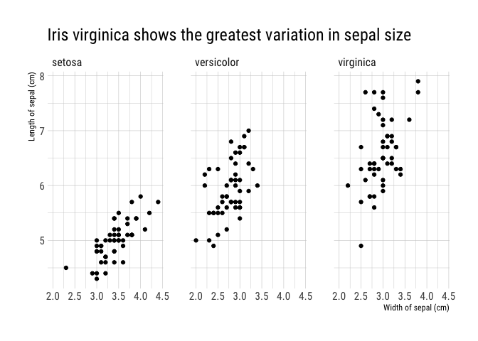
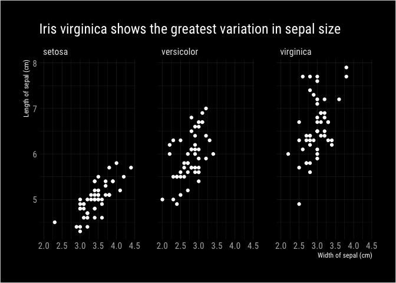

<!-- README.md is generated from README.Rmd. Please edit that file -->
ggdark
======

[](https://travis-ci.org/nsgrantham/ggdark) [](https://ci.appveyor.com/project/nsgrantham/ggdark)

Installation
------------

You can install ggdark from github with:

``` r
# install.packages("devtools")
devtools::install_github("nsgrantham/ggdark")
```

Dark mode for ggplot2
---------------------

``` r
library(ggplot2)

p <- ggplot(diamonds, aes(carat, price)) + 
  geom_point(aes(color = cut))

p + theme_gray()  # ggplot default
```


``` r
library(ggdark)

p + dark_theme_gray()  # the dark version
#> Geom defaults updated to fill = 'white', color = 'white'.
#> To restore the original values, use update_geom_colors().
```


``` r
# modify the theme to your liking, as you would in ggplot2
p + dark_theme_gray(base_family = "Arial Narrow", base_size = 14) + 
  theme(plot.background = element_rect(fill = "grey20"),
        panel.background = element_blank(),
        legend.background = element_blank(),
        legend.key = element_blank(),
        legend.position = c(0.85, 0.2))
```


Dark themes
-----------

ggdark provides dark versions of all themes available in ggplot2:

``` r
mtcars2 <- within(mtcars, {
  vs <- factor(vs, labels = c("V-shaped", "Straight"))
  am <- factor(am, labels = c("Automatic", "Manual"))
  cyl  <- factor(cyl)
  gear <- factor(gear)
})

p <- ggplot(mtcars2) +
  geom_point(aes(x = wt, y = mpg, colour = gear)) +
  facet_grid(vs ~ am) +
  labs(title = "Fuel economy declines as weight increases",
       subtitle = "(1973-74)",
       caption = "Data from the 1974 Motor Trend US magazine.",
       x = "Weight (1000 lbs)",
       y = "Fuel economy (mpg)",
       tag = "Figure 1",
       colour = "Gears")
```

``` r
p + dark_theme_gray()
```


``` r
p + dark_theme_bw()
```


``` r
p + dark_theme_linedraw()
```


``` r
p + dark_theme_light()  # quite dark
```


``` r
p + dark_theme_dark()  # quite light
```


``` r
p + dark_theme_minimal()
```


``` r
p + dark_theme_classic()
```


``` r
p + dark_theme_void()
```


Dark mode on any theme
----------------------

Any theme can have its dark mode activated with `dark_mode`. Here we apply it to themes from the `ggthemes` and `hrbrthemes` packages.

``` r
update_geom_colors()
#> Geom defaults updated to fill = 'black', color = 'black'.

p <- ggplot(iris, aes(Sepal.Width, Sepal.Length)) +
  geom_point() +
  facet_wrap(~ Species)
```

``` r
library(ggthemes)

p + theme_fivethirtyeight()
```


``` r
p + dark_mode(theme_fivethirtyeight())
#> Geom defaults updated to fill = 'white', color = 'white'.
#> To restore the original values, use update_geom_colors().
```


``` r
update_geom_colors()
#> Geom defaults updated to fill = 'black', color = 'black'.
```

``` r
library(hrbrthemes)
#> NOTE: Either Arial Narrow or Roboto Condensed fonts are *required* to use these themes.
#>       Please use hrbrthemes::import_roboto_condensed() to install Roboto Condensed and
#>       if Arial Narrow is not on your system, please see http://bit.ly/arialnarrow

p + theme_ipsum_rc()
```



``` r
p + dark_mode(theme_ipsum_rc(), geom_color = "grey80")  # custom geom color
#> Geom defaults updated to fill = 'white', color = 'white'.
#> To restore the original values, use update_geom_colors().
```



``` r
update_geom_colors()
#> Geom defaults updated to fill = 'black', color = 'black'.
```

License
-------

MIT + file LICENSE

------------------------------------------------------------------------

Happy plotting! 🖤
