<!-- README.md is generated from README.Rmd. Please edit that file -->
ggdark
======

[](https://travis-ci.org/nsgrantham/ggdark) [](https://ci.appveyor.com/project/nsgrantham/ggdark)

Installation
------------

You can install ggdark from GitHub with:

``` r
# install.packages("devtools")
devtools::install_github("nsgrantham/ggdark")
```

Dark mode for ggplot2
---------------------

``` r
library(ggplot2)

p <- ggplot(diamonds) + 
  geom_point(aes(carat, price, color = cut)) + 
  scale_y_continuous(label = scales::dollar) +
  guides(color = guide_legend(reverse = TRUE)) +
  labs(title = "Prices of 50,000 round cut diamonds by carat and cut",
       x = "Weight (carats)",
       y = "Price in US dollars",
       color = "Quality of the cut")

p + theme_gray()  # ggplot default
```

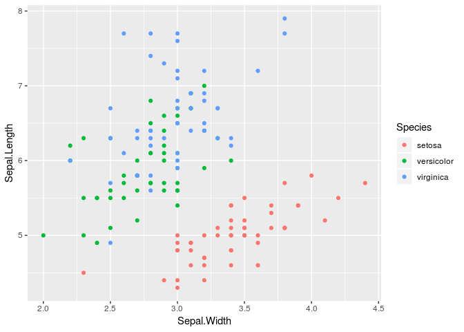

``` r
library(ggdark)

p + dark_theme_gray()  # the dark version
#> Inverted geom defaults of fill and color/colour.
#> To change them back, use invert_geom_defaults().
```

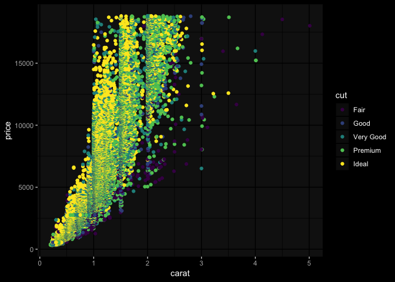

``` r
# modify the theme to your liking, as you would in ggplot2
p + dark_theme_gray(base_family = "Fira Sans Condensed Light", base_size = 14) + 
  theme(plot.title = element_text(family = "Fira Sans Condensed"),
        plot.background = element_rect(fill = "grey10"),
        panel.background = element_blank(),
        panel.grid.major = element_line(color = "grey30", size = 0.2),
        panel.grid.minor = element_line(color = "grey30", size = 0.2),
        legend.background = element_blank(),
        axis.ticks = element_blank(),
        legend.key = element_blank(),
        legend.position = c(0.815, 0.27))
```

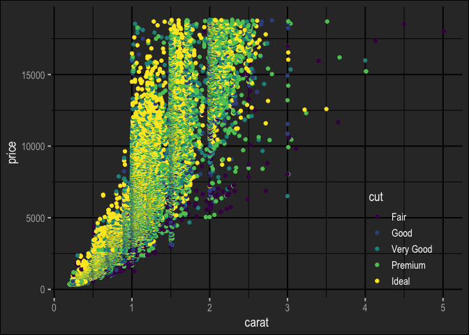

Dark themes
-----------

ggdark provides dark versions of all themes available in ggplot2:

``` r
mtcars2 <- within(mtcars, {
  vs <- factor(vs, labels = c("V-shaped", "Straight"))
  am <- factor(am, labels = c("Automatic", "Manual"))
  cyl  <- factor(cyl)
  gear <- factor(gear)
})

p <- ggplot(mtcars2) +
  geom_point(aes(wt, mpg, color = gear)) +
  facet_grid(vs ~ am) +
  labs(title = "Fuel economy declines as weight increases",
       subtitle = "(1973-74)",
       caption = "Data from the 1974 Motor Trend US magazine.",
       x = "Weight (1000 lbs)",
       y = "Fuel economy (mpg)",
       color = "Gears")
```

``` r
p + dark_theme_gray()
```

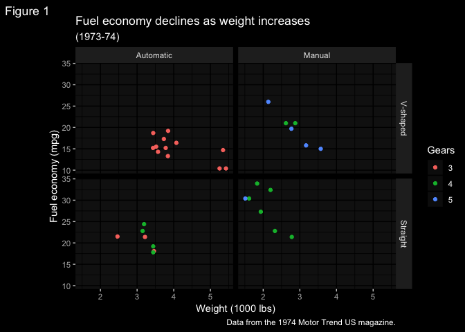

``` r
p + dark_theme_bw()
```

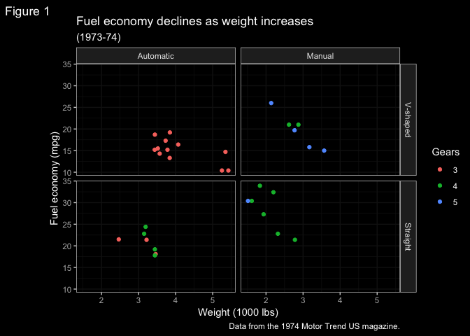

``` r
p + dark_theme_linedraw()
```

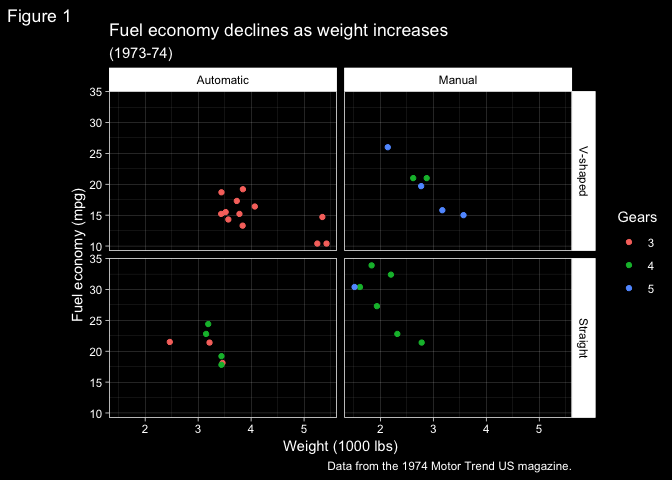

``` r
p + dark_theme_light()  # quite dark
```

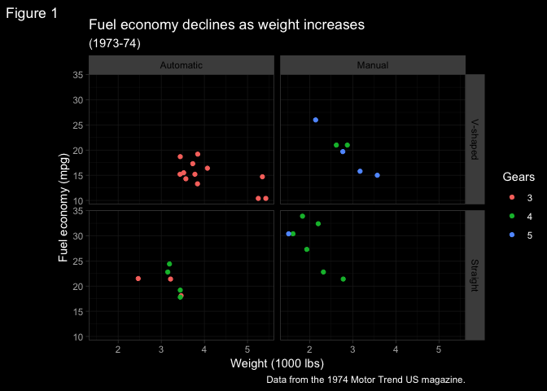

``` r
p + dark_theme_dark()  # quite light
```

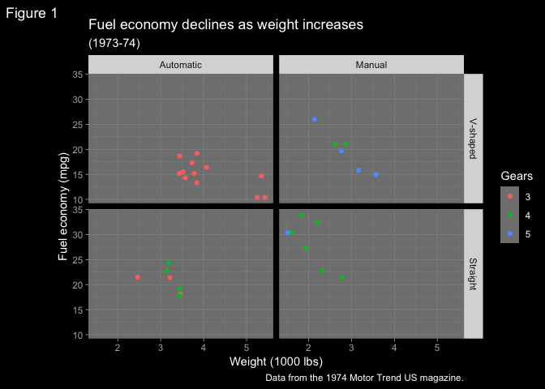

``` r
p + dark_theme_minimal()
```

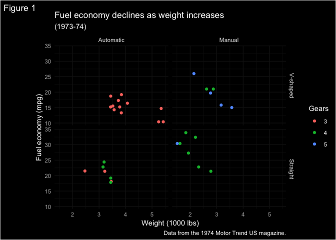

``` r
p + dark_theme_classic()
```


``` r
p + dark_theme_void()
```

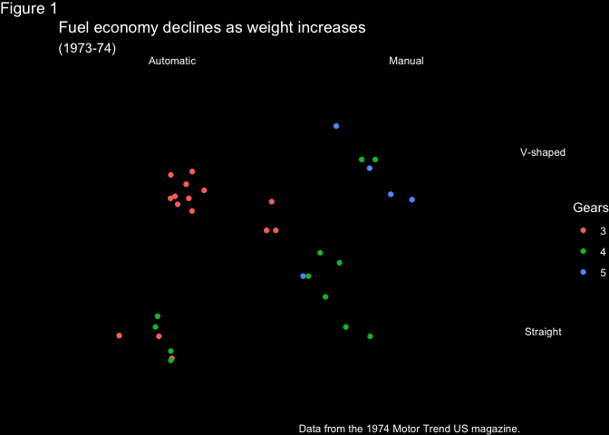

Make your own dark theme
------------------------

Use`dark_mode` on any theme to create its dark version.

``` r
invert_geom_defaults()  # change geom defaults back to black

library(gapminder)

p <- ggplot(subset(gapminder, continent != "Oceania")) +
  geom_line(aes(year, lifeExp, group = country, color = country), lwd = 1, show.legend = FALSE) + 
  facet_wrap(~ continent) +
  scale_color_manual(values = country_colors) +
  labs(title = "Life expectancy has increased across the globe")
```

``` r
# install.packages("ggthemes")
library(ggthemes)

p + theme_fivethirtyeight()
```

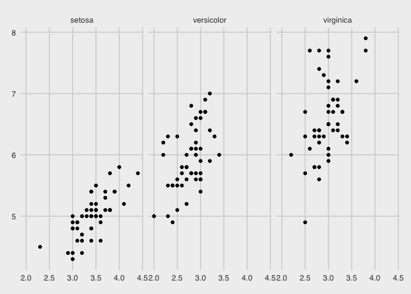

``` r
p + dark_mode(theme_fivethirtyeight())
#> Inverted geom defaults of fill and color/colour.
#> To change them back, use invert_geom_defaults().
```

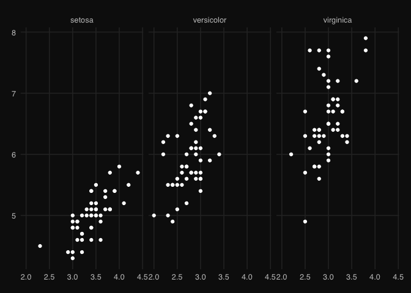

``` r
invert_geom_defaults()  # leave the geom defaults how you found them!
```

Happy plotting! 🖤
