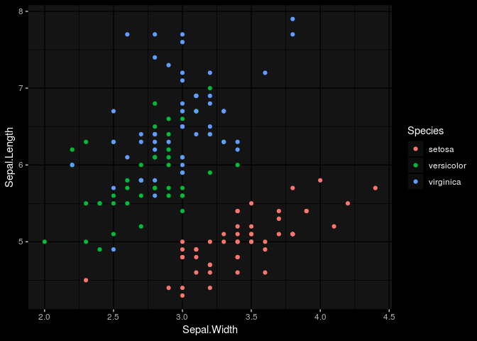
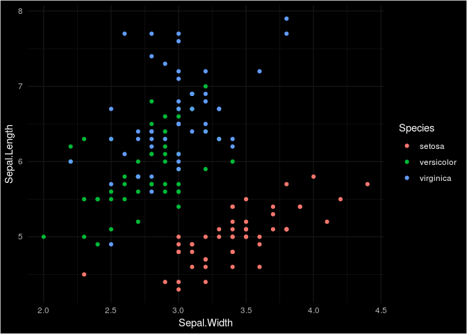
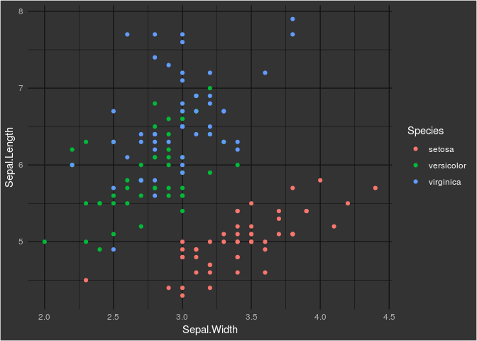
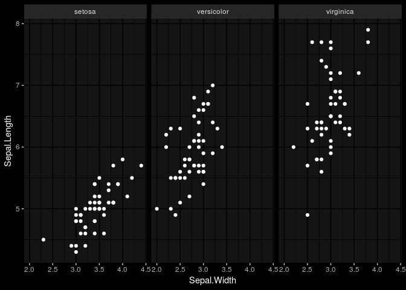
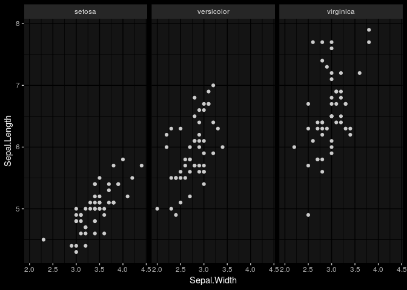

<!-- README.md is generated from README.Rmd. Please edit that file -->
ggdark
======

[](https://travis-ci.org/nsgrantham/ggdark) [](https://ci.appveyor.com/project/nsgrantham/ggdark)

Activate dark mode on your favorite ggplot2 theme with `ggdark::darken`.

Installation
------------

You can install ggdark from github with:

``` r
# install.packages("devtools")
devtools::install_github("nsgrantham/ggdark")
```

Dark mode
---------

`darken` acts on a ggplot2 theme and inverts its colors. It is not itself a ggplot2 theme.

``` r
library(ggplot2)
library(ggdark)

p <- ggplot(iris, aes(Sepal.Width, Sepal.Length)) + 
  geom_point(aes(color = Species))

p  # theme_gray(), the active theme returned by theme_get()
```


``` r
p + darken()  # activate dark mode on theme_gray()
```



``` r
p + darken(theme_minimal())  # darken a different ggplot2 theme
```



``` r
p + darken(theme_minimal(), background = "grey20")  # lighten black background
```



In addition to inverting colors of theme elements, `darken` redefines the default values of geom fill and geom color from `"black"` to `"white"`. This makes the geoms visible against the dark background.

``` r
p <- ggplot(iris, aes(Sepal.Width, Sepal.Length)) +
  geom_point() +
  facet_wrap(~ Species)

p + darken()  # geom color is now white
```



``` r
p + darken(geom_color = "grey80")  # or perhaps a light grey 
```



Restore the geom colors to their ggplot2 defaults with

    restore_geom_colors()  # fill = "black", color = "black"

Take note
---------

`darken` must act directly on the theme it is modifying, layering does not work.

``` r
# darken is not aware of theme_minimal() and will darken the theme returned by theme_get()
p + theme_minimal() + darken()  # darkens theme_gray(), the active theme
```

You can use the pipe operator `%>%` from `magrittr`.

``` r
library(magrittr)
p + theme_minimal() %>% darken()  # darkens theme_minimal()
```

You can also set a new active theme.

``` r
theme_set(theme_minimal())
p + darken()  # darkens theme_minimal(), as it is now returned by theme_get()

# why not turn on dark mode for all plots? :)
theme_set(darken(theme_minimal()))
p  # dark
```

License
-------

MIT + file LICENSE
